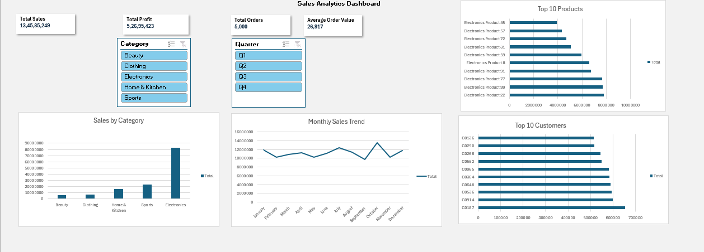

# 📊 Sales Analytics Dashboard (Excel)

## 📌 Project Overview

This project is an interactive Sales Analytics Dashboard built in **Microsoft Excel** to analyze sales performance using Pivot Tables, Pivot Charts, KPI Cards, and Slicers.

## 🚀 Features

- 📈 Total Sales KPI
- 💰 Total Profit KPI
- 📦 Total Orders KPI
- 🛒 Average Order Value
- 📊 Sales by Category
- 📅 Monthly Sales Trend
- 🏆 Top 10 Products by Sales
- 👥 Top 10 Customers by Sales
- 🎛️ Interactive Category and Quarter Slicers

## 🛠️ Tools Used

- Microsoft Excel
- Pivot Tables
- Pivot Charts
- Excel Formulas
- Data Cleaning
- Dashboard Design

## 📂 Dataset

The project includes six datasets:

- Customers
- Orders
- Products
- Payments
- Returns
- Suppliers

## 📸 Dashboard Preview

## 🎯 Skills Demonstrated

- Data Cleaning
- Data Analysis
- Dashboard Design
- KPI Development
- Data Visualization
- Business Reporting
